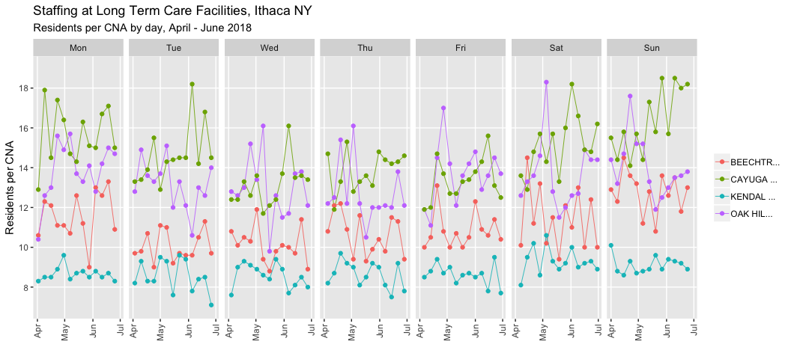
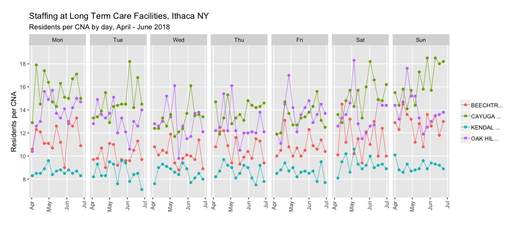
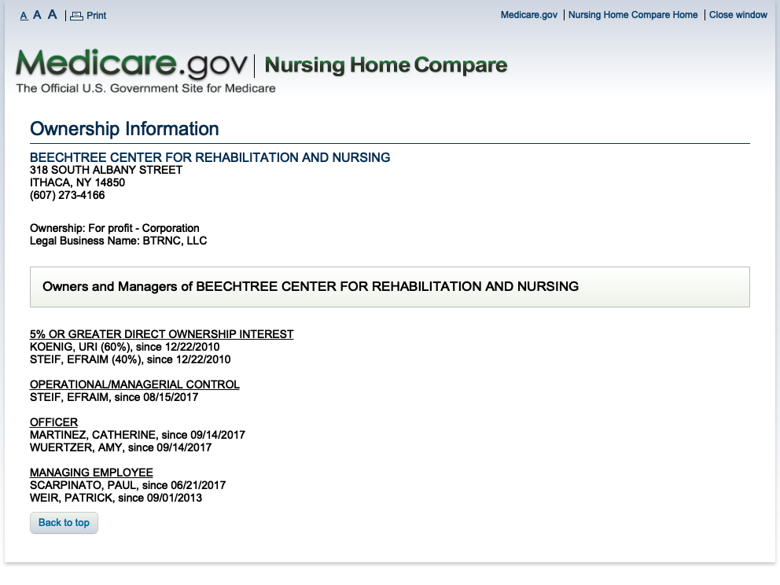

## Staffing by day of week, Apr - Jun 2018


```r
ggplot(data = df_ithaca) +
  geom_path(mapping = aes(x = workdate, y = residents_per_cna, col = str_trunc(provname, 10) ), size = 0.3 ) +
  geom_point(mapping = aes(x = workdate, y = residents_per_cna, col = str_trunc(provname, 10)), size = 1.5) +
  labs(x = "",
       y = "Residents per CNA",
       title = "Staffing at Long Term Care Facilities, Ithaca NY",
       subtitle = "Residents per CNA by day, April - June 2018" ) +
  theme(legend.title = element_blank(),
        panel.grid.minor.x = element_blank(),
        panel.grid.minor.y = element_blank(),
        axis.text.x = element_text(angle = 90, hjust = 1, vjust = 0.5)) +
  facet_grid(.~day) +
  scale_y_continuous(limits = c(7, 19), breaks = seq(8,18, by = 2))
```

<!-- -->

```r
ggsave(filename = "output/ithaca_cna_staffing_pbj_2018_apr-jun_rmd.png",
       width=11,
       height=7,
       dpi = 600)
```


# Nursing Home Compare

https://www.medicare.gov/NursingHomeCompare/


The Medicare.Gov website contains profiles of facilities. (The comparison tool permits only 3 at a time.)


```r
webshot("https://www.medicare.gov/NursingHomeCompare/compare.html#cmprTab=0&cmprID=335017%2C335249%2C335793&cmprDist=1.5%2C2.4%2C4.3&lat=42.435511&lng=-76.5257007&loc=14850",
        "data/compare_seta_1.png",
        delay = 1.0)
```

<!-- -->

## Beechtree Center for Rehabilitation and Nursing - ownership

Some of the information is inaccurate. The people listed as a managing employees no longer work at Beechtree.  

<!-- -->


## Cayuga Ridge Extended Care - ownership

Why is ownership information unavailable for Cayuga Ridge?

<!-- -->

Kendall at Ithaca - ownership

<!-- -->


Oak Hill Manor Nursing Home - ownership

<!-- -->


