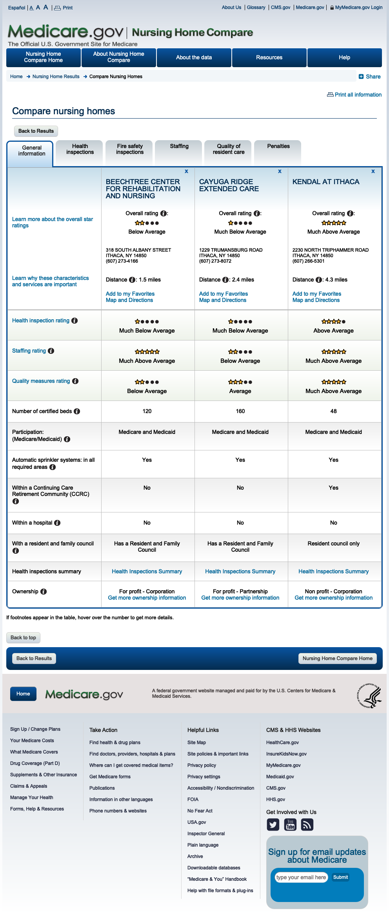

## Staffing by day of week, Apr - Jun 2018


<!-- -->


```r
ggsave(filename = "output/ithaca_cna_staffing_pbj_2018_apr-jun_rmd.png",
       width=11,
       height=7,
       dpi = 600)
```

# Nursing Home Compare

https://www.medicare.gov/NursingHomeCompare/


The Medicare.Gov website contains profiles of facilities. (The comparison tool permits only 3 at a time.)


```r
webshot("https://www.medicare.gov/NursingHomeCompare/compare.html#cmprTab=0&cmprID=335017%2C335249%2C335793&cmprDist=1.5%2C2.4%2C4.3&lat=42.435511&lng=-76.5257007&loc=14850",
        "data/compare_seta_1.png",
        delay = 1.0)
```

<!-- -->

## Beechtree Center for Rehabilitation and Nursing - ownership

Some of the information is inaccurate. The people listed as a managing employees no longer work at Beechtree.  

<!-- -->


## Cayuga Ridge Extended Care - ownership

Why is ownership information unavailable for Cayuga Ridge?

<!-- -->

Kendall at Ithaca - ownership

<!-- -->


Oak Hill Manor Nursing Home - ownership

<!-- -->


